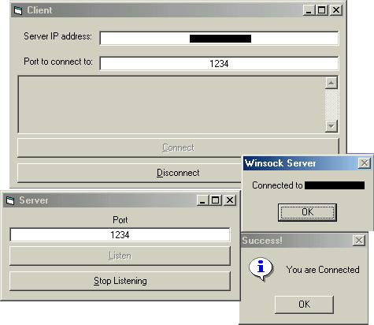



## How to connect using Winsock 4 beginners wanting 2 learn Winsock

### Description

This code is for beginners wanting to learn winsock

**Fully Commented**

Only today i have learned Winsock and this is thanks to someone called carrot in vbchat (irc.vb-chat.com #vbchat) which is also known on PSCODE as "Andrewm1986"

I am at the moment increasing my skills in winsock i have made a chat client and server which later on today will be able to kick & Ban the user which i will upload when i have finished well have fun and people who want to learn Winsock this is your chance!!!
 
### More Info
 

             |
---                |---
**Submitted On**   |2002-01-04 14:40:08
**By**             |[VBRules](https://github.com/Planet-Source-Code/PSCIndex/blob/master/ByAuthor/vbrules.md)
**Level**          |Intermediate
**User Rating**    |4.3 (13 globes from 3 users)
**Compatibility**  |VB 5\.0, VB 6\.0
**Category**       |[Internet/ HTML](https://github.com/Planet-Source-Code/PSCIndex/blob/master/ByCategory/internet-html__1-34.md)
**World**          |[Visual Basic](https://github.com/Planet-Source-Code/PSCIndex/blob/master/ByWorld/visual-basic.md)
**Archive File**   |[How\_to\_con46239142002\.zip](https://github.com/Planet-Source-Code/vbrules-how-to-connect-using-winsock-4-beginners-wanting-2-learn-winsock__1-30379/archive/master.zip)

